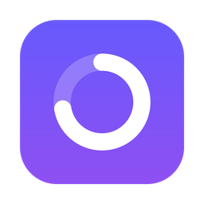
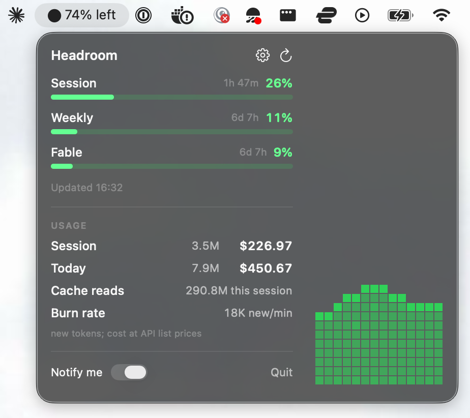
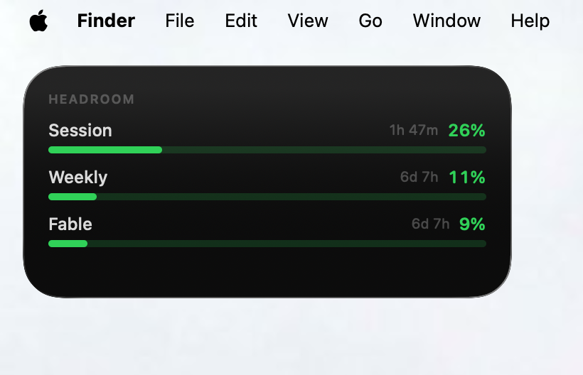

<div align="center">



# Headroom

**How much of your Claude plan is left, at a glance.**




</div>

A menu bar app and a desktop widget. They show how much of your Claude plan you have used, how
many tokens you have spent, and what that work would cost on the API.

Every 60 seconds Headroom asks Anthropic how much of your plan is left, and reads Claude Code's
own log files for your token counts. The menu bar shows what is left. The widget shows the same
thing on your desktop.

## What you see

**In the menu bar**, a bar for each limit: your five hour session, your week, and each per-model
cap. Each one shows how far along you are and when it resets. Below that, tokens and cost for
this session and for today, plus how fast you are spending them.

**On the desktop**, pick a size. Small shows your worst limit as a ring. Medium lists every
limit as bars. Large leads with a ring and lists the rest below it. Right click the desktop and
pick Edit Widgets, or open Notification Center, then search for "Headroom".



You can also pick which limit a widget follows, or leave it on whichever is highest.

## What counts

The two halves of the panel are not measuring the same thing, which is worth knowing before you
read too much into either.

**The bars are your whole plan.** They come from Anthropic and cover everything on your account
that counts toward the five hour and weekly windows. Work you do on claude.ai or in Claude
Desktop moves them too, not just Claude Code.

**The tokens and cost are Claude Code only.** They are read from `~/.claude/projects/`, which is
where the Claude Code CLI writes its session logs. Nothing else is counted.

So the bars answer "how much of my plan is gone" and the numbers answer "how much of that was
the CLI".

One gap that follows from this: **Claude Code run inside Claude Desktop is not counted.** Those
sessions log somewhere else, under `~/Library/Application Support/Claude/`. They still move the
bars, because Anthropic counts them, but they will not show up in your token or cost figures. If
you work mostly in Desktop, your real numbers are higher than what you see here.

Headroom does not read Codex, Gemini, Cursor, or any other tool. Claude only.

## The sprite

Down the right of the menu bar panel is a bit of pixel art that grows with whichever limit is
closest to its cap, and turns green, orange, then red along with the bars. It is there so you
can tell how you are doing without reading a number.

Pick one in Settings:

| | |
| --- | --- |
| **Plant** | A fern. A seedling means plenty of room, a full fern means you are nearly out. |
| **Water** | Water rising up the column, with waves. Full means you are out of room. |
| **Cave** | Rock closing in from the top and bottom. The gap left is your headroom. |

There is also a **Level** setting. **Usage** follows your real numbers. **Demo** ignores them
and sweeps the whole range on a loop, which is the only way to see much when you are sitting at
5%. The Cave in particular is nearly empty below about 40%.

## Notifications

You get one alert each time a limit passes 80%, 95%, and 100%, with a sound at 95% and up. They
arm themselves again when the limit resets. Turn them off from the menu bar panel.

## First run

Headroom reads your Claude Code login out of the keychain, so macOS asks you once whether to
allow it. Click Always Allow. After that it stays quiet: the 60 second poll asks in a way that
cannot open a popup, and only the refresh arrow and the Reconnect button can ever ask again.

## Settings

The gear in the panel opens Settings, or press Cmd+comma. Sprite choice and notifications live
there, with a live preview of the sprite so you can see what you are picking.

## Install

```sh
brew install --cask maximilianfalco/tap/headroom-bar
```

The cask is called `headroom-bar`. Plain `headroom` in Homebrew is a different app by
someone else.

Headroom is signed but not notarized, so the cask clears the Gatekeeper flag for you.

Or clone the repo and run `./build.sh`.

Adding your own sprite takes one file and two lines. See `Shared/Sprites/README.md`.

## Known limits

- **The widget does not really redraw every 60 seconds.** Headroom asks it to, but WidgetKit
  reloads on its own budget. The menu bar number is exact. The widget lags behind it.
- **Not notarized.** Brew clears the Gatekeeper flag for you. If you grab the zip by hand
  instead, macOS will warn you before it opens.

## Privacy

- **Your numbers stay on your Mac.** Token counts and cost come from Claude Code's own log
  files in `~/.claude/projects/`. Headroom pulls out numbers only: how many tokens, which
  model, when, and an id it uses to skip repeats. It never keeps what you or Claude typed, and
  it never keeps which project you were in.
- **One server, one call.** Headroom talks to `api.anthropic.com` and nothing else. No update
  check, no analytics, no crash reports. The call sends your token so the server knows who is
  asking. It sends nothing else.
- **Keychain.** Headroom reads Claude Code's saved login, then keeps a copy of the token in its
  own keychain item. The token never lands on disk.
- **What it saves.** One small file holding your percentages, token counts, and cost, plus a
  few notification settings. Nothing else.
- **Why it is not sandboxed.** A sandboxed app cannot read another app's keychain item. The
  widget *is* sandboxed. It only reads that small file, and it carries none of the code that
  handles logins or reads logs.

## License

MIT, see [LICENSE](LICENSE). That covers the code in this repo. It gives you no rights to
anyone else's name, service, or data.

Headroom is a personal project. Anthropic did not build it, back it, or review it. "Claude" and
"Anthropic" are their names, not this project's.

- It reads an endpoint Anthropic has not documented. They can change or drop it any day.
- It only ever reads your own login and your own logs, on your own Mac.
- The dollar figures are what the same work would cost on the API. Your plan is a flat fee, so
  read them as a size, not a bill.
- Free to use.
- Own a right and see a problem here? Open an issue.

*No warranty. Not legal advice.*
